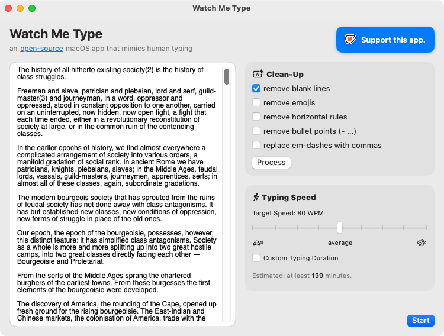
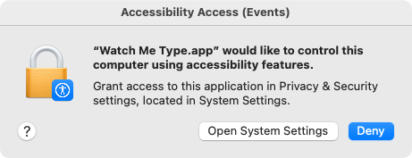
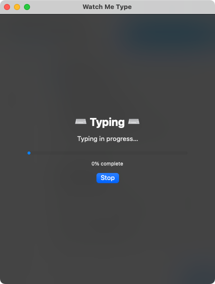
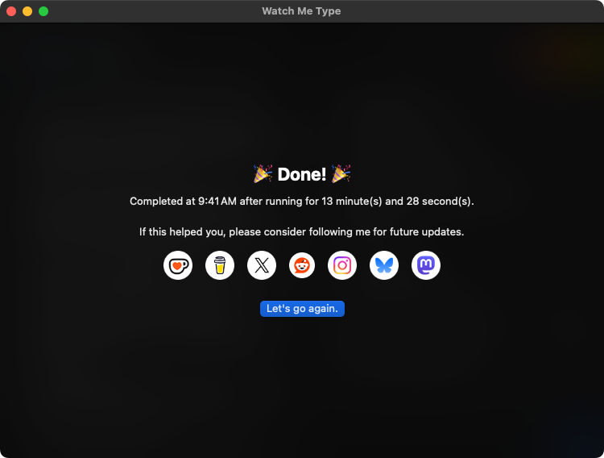

# Watch Me Type

*because revision history is not learning*

Watch Me Type is an open-source macOS app that types text into any active window in a way that resembles normal human typing. It is intended for students who want their writing to have the impression of unfolding over time rather than appearing as a single completed action.

## Purpose

>TL;DR: to force those in charge in education to empower teachers with the resources to adapt to the ubiquity of AI

In the face of genAI, education systems have responded by doubling down on surveillance. Teachers are asked to rely on tools like GPTZero, document revision history, and other forms of process forensics to prove whether a piece of writing is *real*. The burden of this work is pushed downward while the underlying problem is left untouched.

This approach misunderstands both writing and learning. Students do not write in clean, traceable steps. They think out of order. They draft on phones, in notes apps, on paper, in fragments. Or, maybe since teachers just check the final product, students get something like ChatGPT to generate that for them. It's not them being deceitful or devious; *students will always take the path of least resistance.*

**Watch Me Type** exists inside this mess. Not to endorse it, but to expose it. If institutions insist on authentic-looking process instead of authentic *thinking*, then the process itself becomes something students must manufacture.

The solution is not better detection; it's building actual relationships with students and evaluating the growth of their skills. That requires time, trust, and institutional support for teachers to design tasks that cannot be reduced to a final product check. 

**To students:**
>A calculator makes it much easier to cheat on your math test, but it doesn't mean you don't need math in your life. *Apply yourself.*

**To my fellow teachers:**
>Until institutions and governing bodies provide the necessary resources for you to adapt to this new age of AI, I am sorry for the chaos this will create in your classrooms.

**To those in charge in education:**
>You put teachers through school to learn about backwards design and competency-based assessments, but without time, staffing, and institutional support, teachers have to resort to policing student work just to make sure the students *might* be learning. *Please* give teachers the resources they need to actually do their job well and, maybe, you just might prevent their burnout.

## Features

- simulates human typing speed and rhythm
- types into any text field or editor
- supports long sessions and repeated revisions
- optional text clean-up using pre-processing options
- adjustable typing speed and/or target typing duration
- native macOS app
- no accounts, tracking, or analytics

## Built With

- Swift  
- SwiftUI  

## Installation

1. Download [the DMG from the latest release](https://github.com/0xff-r4bbit/watchmetype/releases/latest/download/WatchMeType.dmg).
2. Drag **Watch Me Type** into the **Applications** folder.
3. Launch the app.
4. When macOS asks, grant Accessibility access.

## Usage Notes

- While the app is typing, the device cannot be used. ∴ start typing sessions only when you do not need the device.
- Do not complete an entire piece of writing in a single session if the goal is a realistic revision history.

### Effective Use

This app works best as part of a longer writing process. Generate drafts *elsewhere*, then use Watch Me Type to reproduce how writing normally appears over time.

When generating drafts, use a prompt like the one below. Replace bracketed text as needed.
````
Create a plan for the sections required for this [assignment / project / journal]. We will complete the sections one by one. 

For each section, produce two exemplars:
- one written in B2-level [Canadian / American / British] English
- one written in C2-level English

The B2-level draft should include grammar and usage errors typical of a B2-level English speaker. Avoid stylistic and other linguistic patterns and features identified in AI-generated writing, as detailed in "signs"-of-ai-writing.jpeg”.
````

Attach a screenshot of Wikipedia's "Signs of AI Writing" page, like [this one](assets/signs-of-ai-writing.jpeg), to the prompt. *Do not use a PDF export of the Wikipedia page because somewhere down the line, if they don't already do so, Wikipedia may implement hidden instructions for LLMs scraping their data.*

## Screenshots

<p align="center">
    <br>
    <em>main app window</em>
</p><br>
<p align="center">
    <br>
    <em>macOS Accessibility permission prompt</em>
</p><br>
<p align="center">
    <br>
    <em>typing in progress</em>
</p><br>
<p align="center">
    <br>
    <em>completed session</em>
</p>

## Contributing

Issues, pull requests, and feature suggestions are welcome.

## Supporting this Project

If you find this tool useful or believe in my cause, I would really appreciate your support.

- A tip on **Ko-fi** or **Buy Me a Coffee** would help cover development time and ongoing maintenance.

<p align="center">
    <a href="https://ko-fi.com/U7U01Q0MZE"></a>&emsp;
    <a href="https://buymeacoffee.com/0xff.r4bbit"></a>
</p>

- Following, upvoting, or sharing the project on social platforms would help this reach educators and students who may benefit from it, either for their own work or as justification to rally for institutional change:

<p align="center">
    <a href="https://x.com/0xff_r4bbit"></a>&emsp;
    <a href="https://www.reddit.com/r/SideProject/comments/1po854x/i_made_an_opensource_macos_app_that_simulates/"></a>&emsp;
    <a href="https://www.instagram.com/0xff.r4bbit"></a>&emsp;
    <a href="https://bsky.app/profile/0xff-r4bbit.bsky.social"></a>&emsp;
    <a href="https://mastodon.social/@0xff_r4bbit"></a>&emsp;
</p>

## Licence
This project is released under a source-available licence.

You are free to view, use, and modify the source code for personal and educational purposes. Commercial use, redistribution, hosting, or selling this software, including modified versions, is not permitted without explicit permission from the author.

The source is shared to support transparency, learning, and community discussion, not to enable resale or unauthorised distribution.

For details, see [licence.md](licence.md).