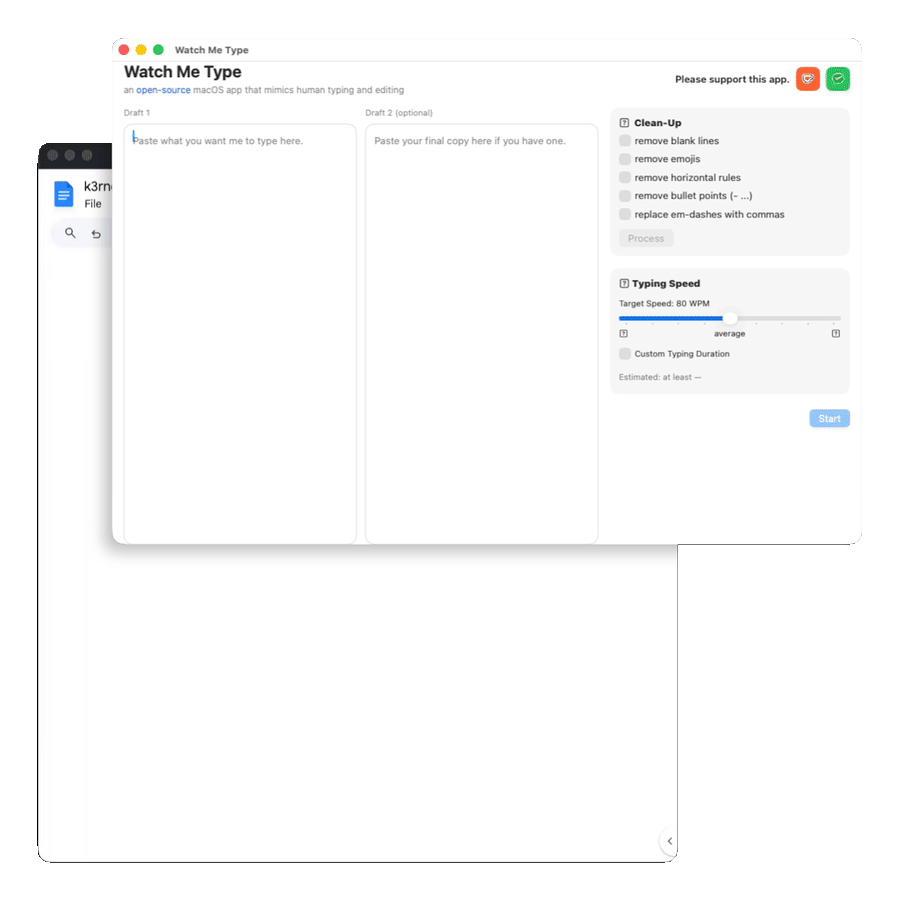

# Watch Me Type

<table align="center">
  <tr>
    <td>
      <p align="center"><strong>⚠️ Warning ⚠️</strong></p>
      <p>Turn off autocorrect before typing with this app. Autocorrect can interfere with realistic drafting, especially when your draft includes intentional grammar or spelling mistakes. Disable it in <a href="https://support.google.com/docs/answer/12022089?hl=en&co=GENIE.Platform%3DDesktop">Google Docs</a> and <a href="https://support.microsoft.com/en-us/office/turn-autocorrect-on-or-off-in-word-9f5a0684-05f6-4510-b419-8f0034caefe4">Microsoft Word</a>.</p>
    </td>
  </tr>
</table>

_because revision history is not learning_

Watch Me Type is an open-source macOS app that types text into any active window with the pacing, pauses, and imperfections of a real person. It can replay a single draft or stage a Draft 1 → Draft 2 revision, locking to the chosen window, auto-pausing on focus changes, and running for at least the duration you need.



## Purpose

> TL;DR: to force those in charge in education to empower teachers with the resources to adapt to the ubiquity of AI

In the face of genAI, education systems have responded by doubling down on surveillance. Teachers are asked to rely on tools like GPTZero, document revision history, and other forms of process forensics to prove whether a piece of writing is _real_. The burden of this work is pushed downward while the underlying problem is left untouched.

This approach misunderstands both writing and learning. Students do not write in clean, traceable steps. They think out of order. They draft on phones, in notes apps, on paper, in fragments. Or, maybe since teachers just check the final product, students get something like ChatGPT to generate that for them. It's not them being deceitful or devious; _students will always take the path of least resistance._

**Watch Me Type** exists inside this mess. Not to endorse it, but to expose it. If institutions insist on authentic-looking process instead of authentic _learning_, then the process itself becomes something students must manufacture.

The solution is not better detection; it's building actual relationships with students and evaluating the growth of their skills. That requires time, trust, and institutional support for teachers to design tasks that cannot be reduced to a final product check.

**To students:**

> A calculator makes it much easier to cheat on your math test, but it doesn't mean you don't need math in your life. _Apply yourself._

**To my fellow teachers:**

> Until institutions and governing bodies provide the necessary resources for you to adapt to this new age of AI, I am sorry for the chaos this may create in your classrooms.

**To those in charge in education:**

> You put teachers through school to learn about backwards design and competency-based assessments, but without time, staffing, and institutional support, teachers have to resort to policing student work just to make sure the students _might_ be learning. _Please_ give teachers the resources they need to actually do their job well and, maybe, you just might prevent their burnout.

## Features

- simulates human typing with adjustable 40–120 WPM, thinking pauses, comma/sentence/paragraph delays, and occasional mistakes with backspaces
- two modes: single-draft typing or two-phase draft1→draft2 editing that rewrites the first draft with cursor-accurate edits and navigation delays
- duration control: auto-estimated or custom minimum typing/editing time targets ("at least") with live progress tracking and a 10-second countdown
- text clean-up tools: remove blank lines/emojis/bullets/horizontal rules, replace em-dashes, and normalize spacing before/within punctuation when processed
- focus-aware: locks to the chosen app/window; typing auto-pauses and auto-resumes when focus returns; editing aborts on focus loss for safety; overlays for countdown/typing/thinking/editing/paused/complete; compact always-on-top runtime window
- completion screen: shows typing/editing/total duration, donation options, share link, and quick reset for another run
- compatible everywhere: types into any macOS text field (Docs, Word, Notes, IDEs, browsers); prevents sleep during sessions; ESC pauses typing and stops editing
- privacy & localization: no accounts or tracking; English, Simplified Chinese, and Traditional Chinese localization
- updates & stack: Sparkle auto-updates; built with SwiftUI + AppKit (NSTextView), CoreGraphics CGEvent keyboard simulation, Accessibility APIs, and centralized logging

## Requirements

- macOS 14.6 or newer
- Accessibility permission enabled for Watch Me Type (required for keyboard simulation and focus tracking)

## Built With

- Swift + SwiftUI
- AppKit (NSTextView) for native text editing
- CoreGraphics (CGEvent) for keyboard simulation
- macOS Accessibility APIs for focus tracking and window control
- Sparkle for in-app updates
- Centralized logging for debugging sessions

## Installation

1. Download the DMG from [the latest release](https://github.com/0xff-r4bbit/watchmetype/releases/).
2. Drag **Watch Me Type** into the **Applications** folder.
3. Launch the app.
4. In the in-app prompt, choose **Continue** and grant Accessibility access in System Settings when prompted.
5. Sparkle will check for updates automatically after launch; manual “Check for Updates” is in the menu.

## Usage Notes

- While the app is typing, the device is effectively unavailable; switching apps auto-pauses until you return.
- Provide Draft 2 to simulate a realistic revision of Draft 1; leave it blank for a single-draft run.
- Use custom durations if you need a session to last a minimum amount of time; otherwise the app estimates based on WPM and text length.
- In Draft 2 editing mode, focus/window changes abort editing to avoid writing in the wrong place; if needed, use Cmd+Z in your target app.
- ESC pauses during typing, but stops editing sessions.
- Do not complete an entire piece of writing in a single session if the goal is a realistic revision history.

### Text Cleanup Behavior

- Click **Process** to apply cleanup to Draft 1 and (if present) Draft 2.
- Toggle-controlled cleanup includes removing blank lines, emojis, horizontal rules, bullet prefixes, and replacing em dashes with commas.
- Space normalization (collapsing repeated spaces and removing spaces before punctuation) is always applied during processing.

### Effective Use

This app works best as part of a longer writing process. Generate drafts _elsewhere_, then use Watch Me Type to reproduce how writing normally appears over time (Draft 1) and, if needed, to stage a believable edit into Draft 2.

When generating drafts, use a prompt like the one below. Replace bracketed text as needed.

```
Create a plan for the sections required for this [assignment / project / journal]. We will complete the sections one by one.

For each section, produce two exemplars:
- one written in B2-level [Canadian / American / British] English
- one written in C2-level English

The B2-level draft should include grammar and usage errors typical of a B2-level English speaker. Avoid stylistic and linguistic patterns commonly associated with AI-generated writing (see `assets/signs-of-ai-writing.jpeg`).
```

## Build from Source

```bash
xcodebuild -project "Watch Me Type.xcodeproj" -scheme "Watch Me Type" -destination 'platform=macOS' build
```

## Run Tests

```bash
xcodebuild -project "Watch Me Type.xcodeproj" -scheme "Watch Me Type" -destination 'platform=macOS' test
```

## Contributing

Issues, pull requests, and feature suggestions are welcome.

## Supporting this Project

Starring and sharing the project would help this reach educators and students who may benefit from it, either for their own work or as justification to rally for institutional change.

## Licence

This project is released under a source-available licence.

You are free to view, use, and modify the source code for personal and educational purposes. Commercial use, redistribution, hosting, or selling this software, including modified versions, is not permitted without explicit permission from the author.

The source is shared to support transparency, learning, and community discussion, not to enable resale or unauthorised distribution.

For details, see [LICENCE.md](LICENCE.md).
